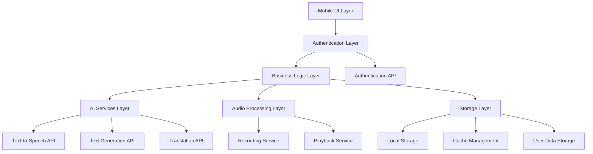

# Design Document

## Overview

Readafull is a mobile application that helps Japanese English learners improve their speaking skills through AI-powered reading practice. The application provides generated English texts with Japanese translations, voice recording capabilities, and AI text-to-speech functionality for comprehensive pronunciation practice.

## Architecture

### High-Level Architecture



### Technology Stack

- **Frontend Framework**: React Native (cross-platform mobile development)
- **State Management**: React Context API or Redux Toolkit
- **Authentication**: Firebase Auth or Auth0 for user management
- **Audio Processing**: react-native-audio-recorder-player
- **AI Services**: OpenAI API or similar for text generation, translation, and TTS
- **Storage**: AsyncStorage for local data persistence, Cloud storage for user data sync
- **Navigation**: React Navigation with authentication guards

## Components and Interfaces

### Core Components

#### 1. TextGeneratorService

```typescript
interface TextGeneratorService {
  generateText(difficulty: DifficultyLevel, topic?: string): Promise<GeneratedText>
  translateToJapanese(englishText: string): Promise<string>
}

interface GeneratedText {
  id: string
  content: string
  difficulty: DifficultyLevel
  translation?: string
  createdAt: Date
}
```

#### 2. AudioService

```typescript
interface AudioService {
  startRecording(): Promise<void>
  stopRecording(): Promise<AudioRecording>
  playRecording(recordingId: string): Promise<void>
  generateTTS(text: string): Promise<AudioFile>
  pausePlayback(): void
  stopPlayback(): void
}

interface AudioRecording {
  id: string
  filePath: string
  duration: number
  createdAt: Date
}
```

#### 3. AuthenticationService

```typescript
interface AuthenticationService {
  signUp(email: string, password: string, preferences?: UserPreferences): Promise<AuthResult>
  signIn(email: string, password: string): Promise<AuthResult>
  signOut(): Promise<void>
  getCurrentUser(): Promise<User | null>
  resetPassword(email: string): Promise<void>
  isAuthenticated(): boolean
  refreshToken(): Promise<string>
}

interface AuthResult {
  user: User
  accessToken: string
  refreshToken: string
}

interface User {
  id: string
  email: string
  preferences: UserPreferences
  createdAt: Date
  lastLoginAt: Date
}
```

#### 4. StorageService

```typescript
interface StorageService {
  saveText(text: GeneratedText, userId: string): Promise<void>
  saveRecording(recording: AudioRecording, userId: string): Promise<void>
  getUserTexts(userId: string): Promise<GeneratedText[]>
  getUserRecordings(userId: string): Promise<AudioRecording[]>
  deleteText(id: string, userId: string): Promise<void>
  deleteRecording(id: string, userId: string): Promise<void>
  saveUserPreferences(userId: string, preferences: UserPreferences): Promise<void>
  getUserPreferences(userId: string): Promise<UserPreferences>
}
```

### UI Components

#### 1. Authentication Screens

- **Sign In Screen**: Email/password login, forgot password link, sign up navigation
- **Sign Up Screen**: Email/password registration, terms acceptance, email verification
- **Password Reset Screen**: Email input for password reset
- **Email Verification Screen**: Confirmation code input

#### 2. Main Practice Screen

- Text display area with toggle for Japanese translation
- Difficulty selector (Beginner, Intermediate, Advanced)
- Generate new text button
- Audio controls (Record, Play recording, TTS playback)
- Progress indicators for audio playback
- User profile access

#### 3. Content Management Screen

- List of saved texts and recordings (user-specific)
- Search and filter functionality
- Delete and organize options
- Sync status indicators

#### 4. Settings Screen

- Audio quality settings
- Default difficulty preference
- Translation display preferences
- Account management (change password, delete account)
- Sign out option

## Data Models

### Text Content Model

```typescript
interface TextContent {
  id: string
  englishText: string
  japaneseTranslation: string
  difficulty: 'beginner' | 'intermediate' | 'advanced'
  wordCount: number
  estimatedReadingTime: number
  createdAt: Date
  lastAccessedAt: Date
}
```

### Audio Session Model

```typescript
interface AudioSession {
  id: string
  textId: string
  recordingPath: string
  duration: number
  createdAt: Date
  playbackCount: number
}
```

### User Preferences Model

```typescript
interface UserPreferences {
  defaultDifficulty: DifficultyLevel
  showTranslationByDefault: boolean
  audioQuality: 'low' | 'medium' | 'high'
  autoPlayTTS: boolean
}
```

## Error Handling

### Error Categories

1. **Network Errors**: AI service unavailable, slow connection
2. **Audio Errors**: Microphone permissions, recording failures, playback issues
3. **Storage Errors**: Insufficient space, file corruption
4. **Authentication Errors**: Invalid credentials, expired tokens, network authentication failures
5. **Validation Errors**: Invalid input parameters, malformed data

### Error Handling Strategy

```typescript
interface ErrorHandler {
  handleNetworkError(error: NetworkError): void
  handleAudioError(error: AudioError): void
  handleStorageError(error: StorageError): void
  handleAuthError(error: AuthError): void
  showUserFriendlyMessage(errorType: ErrorType): void
  redirectToLogin(): void
}
```

### Retry Mechanisms

- Automatic retry for network requests (3 attempts with exponential backoff)
- Manual retry options for failed operations
- Offline mode with cached content when network unavailable

## Testing Strategy

### Unit Testing

- **Services Testing**: Mock AI APIs, test audio service functionality
- **Component Testing**: React Native Testing Library for UI components
- **Utility Testing**: Text processing, validation functions

### Integration Testing

- **API Integration**: Test actual AI service responses
- **Audio Integration**: Test recording and playback on real devices
- **Storage Integration**: Test data persistence and retrieval

### End-to-End Testing

- **User Workflows**: Complete practice sessions from text generation to recording
- **Cross-Platform**: Test on both iOS and Android devices
- **Performance**: Audio latency, app responsiveness, memory usage

### Test Coverage Goals

- Minimum 80% code coverage for business logic
- 100% coverage for critical paths (audio recording, text generation)
- Manual testing for user experience and accessibility

## Performance Considerations

### Audio Performance

- Use native audio modules for low-latency recording
- Implement audio compression for storage efficiency
- Background audio processing to maintain UI responsiveness

### AI Service Optimization

- Cache frequently requested translations
- Implement request debouncing for text generation
- Fallback to cached content when services are slow

### Storage Optimization

- Implement automatic cleanup of old recordings
- Compress audio files without quality loss
- Lazy loading for content lists

## Security and Privacy

### Data Protection

- Store audio recordings locally only
- Encrypt sensitive user data
- Implement secure API key management

### Permissions

- Request microphone permissions with clear explanation
- Graceful degradation when permissions denied
- Respect user privacy preferences

## Accessibility

### Audio Accessibility

- Visual indicators for audio playback status
- Haptic feedback for recording states
- Support for hearing-impaired users with visual cues

### UI Accessibility

- Screen reader compatibility
- High contrast mode support
- Adjustable font sizes
- Voice control integration
