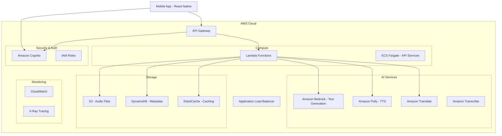

# AWS-Based Design Document

## Overview

Readafull is a mobile application that helps Japanese English learners improve their speaking skills through AI-powered reading practice. This AWS-based design leverages cloud services for scalability, reliability, and advanced AI capabilities while maintaining a responsive mobile experience.

## Architecture

### High-Level AWS Architecture



### Technology Stack

- **Frontend**: React Native with AWS Amplify SDK
- **API Layer**: AWS API Gateway + Lambda Functions
- **Authentication**: Amazon Cognito
- **Text Generation**: Amazon Bedrock (Claude/GPT models)
- **Text-to-Speech**: Amazon Polly
- **Translation**: Amazon Translate
- **Speech Recognition**: Amazon Transcribe (for future features)
- **Storage**: Amazon S3 (audio files) + DynamoDB (metadata)
- **Caching**: Amazon ElastiCache (Redis)
- **Monitoring**: CloudWatch + X-Ray

## AWS Services Integration

### 1. Amazon Bedrock - Text Generation

```typescript
interface BedrockTextService {
  generateText(difficulty: DifficultyLevel, topic?: string): Promise<GeneratedText>

  // Implementation uses Bedrock Runtime API
  async generateText(difficulty: DifficultyLevel): Promise<GeneratedText> {
    const prompt = this.buildPrompt(difficulty);
    const response = await bedrockRuntime.invokeModel({
      modelId: 'anthropic.claude-3-sonnet-20240229-v1:0',
      body: JSON.stringify({
        anthropic_version: 'bedrock-2023-05-31',
        messages: [{ role: 'user', content: prompt }],
        max_tokens: 500
      })
    });
    return this.parseResponse(response);
  }
}
```

### 2. Amazon Polly - Text-to-Speech

```typescript
interface PollyTTSService {
  generateSpeech(text: string, voiceId?: string): Promise<AudioBuffer>

  async generateSpeech(text: string): Promise<AudioBuffer> {
    const params = {
      Text: text,
      OutputFormat: 'mp3',
      VoiceId: 'Joanna', // English voice
      Engine: 'neural'
    };

    const response = await polly.synthesizeSpeech(params);
    return response.AudioStream;
  }
}
```

### 3. Amazon Translate - Japanese Translation

```typescript
interface TranslateService {
  translateToJapanese(englishText: string): Promise<string>

  async translateToJapanese(text: string): Promise<string> {
    const params = {
      Text: text,
      SourceLanguageCode: 'en',
      TargetLanguageCode: 'ja'
    };

    const response = await translate.translateText(params);
    return response.TranslatedText;
  }
}
```

### 4. Amazon S3 - Audio Storage

```typescript
interface S3AudioService {
  uploadRecording(audioBuffer: Buffer, userId: string): Promise<string>
  getRecordingUrl(key: string): Promise<string>

  async uploadRecording(audioBuffer: Buffer, userId: string): Promise<string> {
    const key = `recordings/${userId}/${Date.now()}.mp3`;

    await s3.putObject({
      Bucket: 'readafull-audio-storage',
      Key: key,
      Body: audioBuffer,
      ContentType: 'audio/mpeg',
      ServerSideEncryption: 'AES256'
    });

    return key;
  }
}
```

### 5. DynamoDB - Metadata Storage

```typescript
// Table Schemas
interface TextContentTable {
  PK: string; // USER#userId
  SK: string; // TEXT#textId
  englishText: string;
  japaneseTranslation: string;
  difficulty: string;
  wordCount: number;
  createdAt: string;
  lastAccessedAt: string;
  GSI1PK: string; // DIFFICULTY#level
  GSI1SK: string; // CREATED#timestamp
}

interface AudioSessionTable {
  PK: string; // USER#userId
  SK: string; // AUDIO#sessionId
  textId: string;
  s3Key: string;
  duration: number;
  createdAt: string;
  playbackCount: number;
}
```

## Lambda Functions Architecture

### 1. Text Generation Function

```typescript
// Lambda: generate-text
export const handler = async (event: APIGatewayProxyEvent) => {
  const { difficulty, topic } = JSON.parse(event.body);
  const userId = event.requestContext.authorizer.claims.sub;

  try {
    // Generate text using Bedrock
    const generatedText = await bedrockService.generateText(difficulty, topic);

    // Translate to Japanese
    const translation = await translateService.translateToJapanese(generatedText.content);

    // Save to DynamoDB
    const textRecord = {
      ...generatedText,
      japaneseTranslation: translation,
      userId
    };
    await dynamoService.saveText(textRecord);

    // Cache for quick access
    await cacheService.setTextCache(textRecord.id, textRecord);

    return {
      statusCode: 200,
      body: JSON.stringify(textRecord)
    };
  } catch (error) {
    await cloudWatchService.logError('text-generation-error', error);
    return {
      statusCode: 500,
      body: JSON.stringify({ error: 'Text generation failed' })
    };
  }
};
```

### 2. Audio Processing Function

```typescript
// Lambda: process-audio
export const handler = async (event: S3Event) => {
  for (const record of event.Records) {
    const bucket = record.s3.bucket.name;
    const key = record.s3.object.key;

    try {
      // Get audio metadata
      const audioInfo = await getAudioMetadata(bucket, key);

      // Update DynamoDB with processing status
      await dynamoService.updateAudioSession(key, {
        processingStatus: 'completed',
        duration: audioInfo.duration
      });

      // Optional: Transcribe for future pronunciation analysis
      if (audioInfo.duration > 5) { // Only transcribe longer recordings
        await transcribeService.startTranscription(bucket, key);
      }

    } catch (error) {
      await cloudWatchService.logError('audio-processing-error', error);
    }
  }
};
```

### 3. TTS Generation Function

```typescript
// Lambda: generate-tts
export const handler = async (event: APIGatewayProxyEvent) => {
  const { textId } = event.pathParameters;
  const userId = event.requestContext.authorizer.claims.sub;

  try {
    // Get text from cache or DynamoDB
    let textRecord = await cacheService.getTextCache(textId);
    if (!textRecord) {
      textRecord = await dynamoService.getText(userId, textId);
      await cacheService.setTextCache(textId, textRecord);
    }

    // Generate TTS audio
    const audioBuffer = await pollyService.generateSpeech(textRecord.englishText);

    // Upload to S3
    const s3Key = await s3Service.uploadTTSAudio(audioBuffer, userId, textId);

    // Generate presigned URL for mobile app
    const audioUrl = await s3Service.getPresignedUrl(s3Key);

    return {
      statusCode: 200,
      body: JSON.stringify({ audioUrl, duration: audioBuffer.length })
    };
  } catch (error) {
    await cloudWatchService.logError('tts-generation-error', error);
    return {
      statusCode: 500,
      body: JSON.stringify({ error: 'TTS generation failed' })
    };
  }
};
```

### 4. User Management Functions

```typescript
// Lambda: user-profile
export const handler = async (event: APIGatewayProxyEvent) => {
  const userId = event.requestContext.authorizer.claims.sub;
  const httpMethod = event.httpMethod;

  try {
    switch (httpMethod) {
      case 'GET':
        // Get user profile and preferences
        const userProfile = await dynamoService.getUserProfile(userId);
        return {
          statusCode: 200,
          body: JSON.stringify(userProfile)
        };

      case 'PUT':
        // Update user preferences
        const { preferences } = JSON.parse(event.body);
        await dynamoService.updateUserPreferences(userId, preferences);

        // Update Cognito user attributes if needed
        if (preferences.defaultDifficulty) {
          await cognitoService.updateUserAttribute(userId, 'difficulty_preference', preferences.defaultDifficulty);
        }

        return {
          statusCode: 200,
          body: JSON.stringify({ message: 'Profile updated successfully' })
        };

      default:
        return {
          statusCode: 405,
          body: JSON.stringify({ error: 'Method not allowed' })
        };
    }
  } catch (error) {
    await cloudWatchService.logError('user-profile-error', error);
    return {
      statusCode: 500,
      body: JSON.stringify({ error: 'Profile operation failed' })
    };
  }
};

// Lambda: post-confirmation-trigger (Cognito Trigger for Social Login)
export const postConfirmationHandler = async (event: CognitoUserPoolTriggerEvent) => {
  const userId = event.request.userAttributes.sub;
  const email = event.request.userAttributes.email;
  const name = event.request.userAttributes.name || event.request.userAttributes.given_name;
  const profilePicture = event.request.userAttributes.picture;
  const provider = event.request.userAttributes['custom:provider'] || 'unknown';

  try {
    // Create user profile in DynamoDB for social login user
    await dynamoService.createUserProfile({
      PK: `USER#${userId}`,
      SK: 'PROFILE#main',
      userId,
      email: email || null,
      name: name || 'User',
      profilePicture: profilePicture || null,
      provider,
      preferences: {
        defaultDifficulty: 'beginner',
        showTranslationByDefault: true,
        audioQuality: 'medium',
        autoPlayTTS: false
      },
      createdAt: new Date().toISOString(),
      lastLoginAt: new Date().toISOString()
    });

    return event;
  } catch (error) {
    console.error('Post-confirmation trigger error:', error);
    throw error;
  }
};

// Lambda: pre-token-generation-trigger (Add custom claims)
export const preTokenGenerationHandler = async (event: CognitoUserPoolTriggerEvent) => {
  try {
    // Add custom claims to the token
    event.response.claimsOverrideDetails = {
      claimsToAddOrOverride: {
        'custom:provider': event.request.userAttributes['custom:provider'] || 'unknown',
        'custom:difficulty_preference': event.request.userAttributes['custom:difficulty_preference'] || 'beginner'
      }
    };

    return event;
  } catch (error) {
    console.error('Pre-token generation trigger error:', error);
    throw error;
  }
};
```

## Data Models (DynamoDB)

### Single Table Design

```typescript
// Primary Table: readafull-main-table
interface MainTableItem {
  PK: string;    // Partition Key
  SK: string;    // Sort Key
  GSI1PK?: string; // Global Secondary Index 1 PK
  GSI1SK?: string; // Global Secondary Index 1 SK
  entityType: 'USER' | 'TEXT' | 'AUDIO' | 'PREFERENCE';
  [key: string]: any;
}

// Access Patterns:
// 1. Get user texts: PK = USER#userId, SK begins_with TEXT#
// 2. Get user audio: PK = USER#userId, SK begins_with AUDIO#
// 3. Get texts by difficulty: GSI1PK = DIFFICULTY#level, GSI1SK = CREATED#timestamp
// 4. Get user preferences: PK = USER#userId, SK = PREFERENCE#settings
```

## Security and Authentication

### Amazon Cognito Integration

#### User Pool Configuration with Social Login

```typescript
const userPoolConfig = {
  UserPoolName: 'readafull-users',
  // No password policy needed for social login
  AutoVerifiedAttributes: ['email'],
  UsernameAttributes: ['email'],
  Schema: [
    {
      Name: 'preferred_language',
      AttributeDataType: 'String',
      Mutable: true
    },
    {
      Name: 'difficulty_preference',
      AttributeDataType: 'String',
      Mutable: true
    },
    {
      Name: 'provider',
      AttributeDataType: 'String',
      Mutable: false
    },
    {
      Name: 'profile_picture',
      AttributeDataType: 'String',
      Mutable: true
    }
  ]
};

// Identity Providers Configuration
const identityProviders = {
  Google: {
    ProviderName: 'Google',
    ProviderType: 'Google',
    ProviderDetails: {
      client_id: process.env.GOOGLE_CLIENT_ID,
      client_secret: process.env.GOOGLE_CLIENT_SECRET,
      authorize_scopes: 'email profile openid'
    },
    AttributeMapping: {
      email: 'email',
      name: 'name',
      picture: 'picture',
      username: 'sub'
    }
  },
  Facebook: {
    ProviderName: 'Facebook',
    ProviderType: 'Facebook',
    ProviderDetails: {
      client_id: process.env.FACEBOOK_APP_ID,
      client_secret: process.env.FACEBOOK_APP_SECRET,
      authorize_scopes: 'email,public_profile'
    },
    AttributeMapping: {
      email: 'email',
      name: 'name',
      picture: 'picture',
      username: 'id'
    }
  },
  Apple: {
    ProviderName: 'SignInWithApple',
    ProviderType: 'SignInWithApple',
    ProviderDetails: {
      client_id: process.env.APPLE_CLIENT_ID,
      team_id: process.env.APPLE_TEAM_ID,
      key_id: process.env.APPLE_KEY_ID,
      private_key: process.env.APPLE_PRIVATE_KEY,
      authorize_scopes: 'email name'
    },
    AttributeMapping: {
      email: 'email',
      name: 'name',
      username: 'sub'
    }
  }
};
```

#### Social Authentication Service Implementation

```typescript
interface SocialAuthService {
  signInWithGoogle(): Promise<AuthenticationResult>
  signInWithFacebook(): Promise<AuthenticationResult>
  signInWithApple(): Promise<AuthenticationResult>
  signOut(): Promise<void>
  getCurrentUser(): Promise<CognitoUser | null>
  refreshSession(): Promise<CognitoUserSession>
}

// Mobile App Integration with AWS Amplify and Social Providers
import { Auth } from 'aws-amplify';
import { GoogleSignin } from '@react-native-google-signin/google-signin';
import { LoginManager, AccessToken } from 'react-native-fbsdk-next';
import { appleAuth } from '@invertase/react-native-apple-authentication';

class SocialAuthenticationService implements SocialAuthService {
  async signInWithGoogle(): Promise<AuthenticationResult> {
    try {
      // Configure Google Sign-In
      await GoogleSignin.hasPlayServices();
      const userInfo = await GoogleSignin.signIn();

      // Sign in to Cognito with Google token
      const cognitoUser = await Auth.federatedSignIn(
        'google',
        { token: userInfo.idToken },
        userInfo.user
      );

      const session = await Auth.currentSession();
      return {
        user: cognitoUser,
        accessToken: session.getAccessToken().getJwtToken(),
        idToken: session.getIdToken().getJwtToken(),
        refreshToken: session.getRefreshToken().getToken(),
        provider: 'google'
      };
    } catch (error) {
      throw this.handleSocialAuthError(error, 'google');
    }
  }

  async signInWithFacebook(): Promise<AuthenticationResult> {
    try {
      const result = await LoginManager.logInWithPermissions(['public_profile', 'email']);

      if (result.isCancelled) {
        throw new Error('Facebook login was cancelled');
      }

      const data = await AccessToken.getCurrentAccessToken();
      if (!data) {
        throw new Error('Failed to get Facebook access token');
      }

      // Sign in to Cognito with Facebook token
      const cognitoUser = await Auth.federatedSignIn(
        'facebook',
        { token: data.accessToken },
        {}
      );

      const session = await Auth.currentSession();
      return {
        user: cognitoUser,
        accessToken: session.getAccessToken().getJwtToken(),
        idToken: session.getIdToken().getJwtToken(),
        refreshToken: session.getRefreshToken().getToken(),
        provider: 'facebook'
      };
    } catch (error) {
      throw this.handleSocialAuthError(error, 'facebook');
    }
  }

  async signInWithApple(): Promise<AuthenticationResult> {
    try {
      const appleAuthRequestResponse = await appleAuth.performRequest({
        requestedOperation: appleAuth.Operation.LOGIN,
        requestedScopes: [appleAuth.Scope.EMAIL, appleAuth.Scope.FULL_NAME],
      });

      const { identityToken, nonce } = appleAuthRequestResponse;

      if (!identityToken) {
        throw new Error('Apple Sign-In failed - no identity token');
      }

      // Sign in to Cognito with Apple token
      const cognitoUser = await Auth.federatedSignIn(
        'apple',
        { token: identityToken },
        { nonce }
      );

      const session = await Auth.currentSession();
      return {
        user: cognitoUser,
        accessToken: session.getAccessToken().getJwtToken(),
        idToken: session.getIdToken().getJwtToken(),
        refreshToken: session.getRefreshToken().getToken(),
        provider: 'apple'
      };
    } catch (error) {
      throw this.handleSocialAuthError(error, 'apple');
    }
  }

  private handleSocialAuthError(error: any, provider: string): AuthError {
    console.error(`${provider} authentication error:`, error);

    if (error.code === 'UserCancel' || error.message?.includes('cancelled')) {
      return new AuthError(`${provider} sign-in was cancelled`, 'USER_CANCELLED');
    }

    if (error.code === 'NetworkError') {
      return new AuthError('Network error during sign-in', 'NETWORK_ERROR');
    }

    return new AuthError(`${provider} sign-in failed`, 'SOCIAL_AUTH_ERROR');
  }
}
```

### IAM Roles and Policies

```json
{
  "Version": "2012-10-17",
  "Statement": [
    {
      "Effect": "Allow",
      "Action": [
        "bedrock:InvokeModel"
      ],
      "Resource": "arn:aws:bedrock:*:*:foundation-model/anthropic.claude-*"
    },
    {
      "Effect": "Allow",
      "Action": [
        "polly:SynthesizeSpeech"
      ],
      "Resource": "*"
    },
    {
      "Effect": "Allow",
      "Action": [
        "translate:TranslateText"
      ],
      "Resource": "*"
    },
    {
      "Effect": "Allow",
      "Action": [
        "s3:GetObject",
        "s3:PutObject"
      ],
      "Resource": "arn:aws:s3:::readafull-audio-storage/*"
    }
  ]
}
```

## Error Handling and Resilience

### Circuit Breaker Pattern

```typescript
class AWSServiceCircuitBreaker {
  private failureCount = 0;
  private lastFailureTime = 0;
  private readonly threshold = 5;
  private readonly timeout = 60000; // 1 minute

  async callService<T>(serviceCall: () => Promise<T>): Promise<T> {
    if (this.isCircuitOpen()) {
      throw new Error('Service temporarily unavailable');
    }

    try {
      const result = await serviceCall();
      this.onSuccess();
      return result;
    } catch (error) {
      this.onFailure();
      throw error;
    }
  }
}
```

### Retry Strategy with Exponential Backoff

```typescript
const retryConfig = {
  retries: 3,
  retryDelayOptions: {
    customBackoff: (retryCount: number) => Math.pow(2, retryCount) * 1000
  }
};
```

## Monitoring and Observability

### CloudWatch Metrics

- API Gateway request count and latency
- Lambda function duration and error rates
- DynamoDB read/write capacity utilization
- S3 request metrics
- Bedrock model invocation metrics

### X-Ray Tracing

```typescript
const AWSXRay = require('aws-xray-sdk-core');
const AWS = AWSXRay.captureAWS(require('aws-sdk'));

// Automatic tracing for Lambda functions and AWS service calls
```

### Custom Metrics

```typescript
const cloudWatch = new AWS.CloudWatch();

await cloudWatch.putMetricData({
  Namespace: 'Readafull/App',
  MetricData: [
    {
      MetricName: 'TextGenerationSuccess',
      Value: 1,
      Unit: 'Count',
      Dimensions: [
        {
          Name: 'Difficulty',
          Value: difficulty
        }
      ]
    }
  ]
});
```

## Cost Optimization

### Strategies

1. **Lambda**: Use ARM-based Graviton2 processors for better price-performance
2. **S3**: Implement lifecycle policies to move old audio files to cheaper storage classes
3. **DynamoDB**: Use on-demand billing for unpredictable workloads
4. **Bedrock**: Cache frequently generated text patterns
5. **ElastiCache**: Reduce API calls by caching translations and generated content

### Estimated Monthly Costs (for 1000 active users)

- API Gateway: ~$10
- Lambda: ~$15
- DynamoDB: ~$25
- S3: ~$20
- Bedrock: ~$50
- Polly: ~$30
- Translate: ~$15
- ElastiCache: ~$40
- **Total**: ~$205/month

## Deployment Strategy

### Infrastructure as Code (CDK)

```typescript
import * as cdk from 'aws-cdk-lib';
import * as lambda from 'aws-cdk-lib/aws-lambda';
import * as apigateway from 'aws-cdk-lib/aws-apigateway';
import * as dynamodb from 'aws-cdk-lib/aws-dynamodb';

export class ReadafullStack extends cdk.Stack {
  constructor(scope: Construct, id: string, props?: cdk.StackProps) {
    super(scope, id, props);

    // DynamoDB Table
    const mainTable = new dynamodb.Table(this, 'MainTable', {
      partitionKey: { name: 'PK', type: dynamodb.AttributeType.STRING },
      sortKey: { name: 'SK', type: dynamodb.AttributeType.STRING },
      billingMode: dynamodb.BillingMode.ON_DEMAND
    });

    // Lambda Functions
    const textGenerationFunction = new lambda.Function(this, 'TextGeneration', {
      runtime: lambda.Runtime.NODEJS_18_X,
      handler: 'index.handler',
      code: lambda.Code.fromAsset('lambda/text-generation')
    });

    // API Gateway
    const api = new apigateway.RestApi(this, 'ReadafullAPI');
    // ... rest of the infrastructure
  }
}
```

This AWS-based design provides a scalable, serverless architecture that can handle varying loads while maintaining cost efficiency and high availability.
